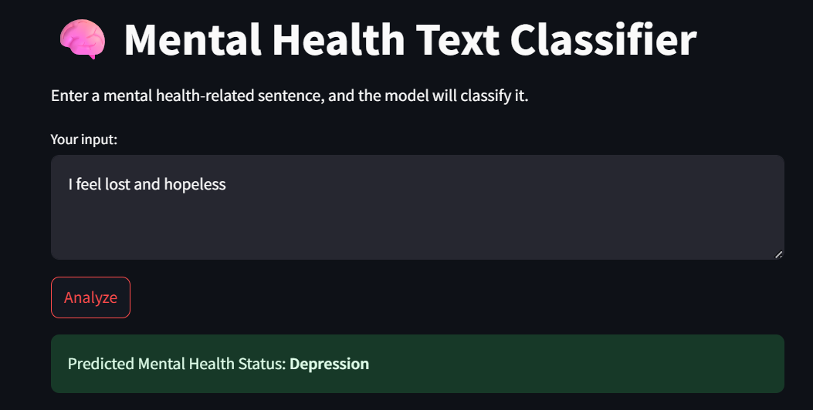

# 🧠 Mental Health Text Classifier

This Streamlit app uses a machine learning model to classify mental health statuses like **Depression**, **Anxiety**, **Suicidal**, and more based on text input. It's trained on a diverse dataset of social media posts and mental health records.

---

## 🚀 Try it Live

👉 [Click to open the live app](https://your-username.streamlit.app)

---

## 🔍 Features

- Input any mental health-related sentence
- Get real-time classification results
- Pie chart showing prediction confidence
- Clean and responsive Streamlit interface

---

## 🧠 Model Details

- **Model:** Logistic Regression (with class weights)
- **Vectorizer:** TF-IDF (5000 top features)
- **Labels:**
  - Normal
  - Depression
  - Suicidal
  - Anxiety
  - Stress
  - Bipolar
  - Personality Disorder

---

## 🖼 Example

Input: "I feel lost and hopeless"
→ Output: Depression

 

---

## 🧪 How It Works

1. Cleans the input text (lowercase, punctuation removal)
2. Transforms it using a pre-trained TF-IDF vectorizer
3. Predicts mental health label using Logistic Regression
4. Displays prediction + pie chart of confidence

---

## 🧰 Tech Stack

- Python
- Streamlit
- Scikit-learn
- Joblib
- Matplotlib
- Pandas

---

## 📁 Project Structure
├── app.py
├── logistic_model.pkl
├── tfidf_vectorizer.pkl
├── requirements.txt
├── outputs/
│ └── example-output.png
└── README.md

---

## ✨ Future Enhancements

- Adding model options (Random Forest, SVM, etc.)
- Integrating multi-label classification
- Deploying on Hugging Face or Render
- Accepting batch text file or CSV uploads

---

## 👩‍💻 Author

Umme Fatema  
Machine Learning Enthusiast
---

